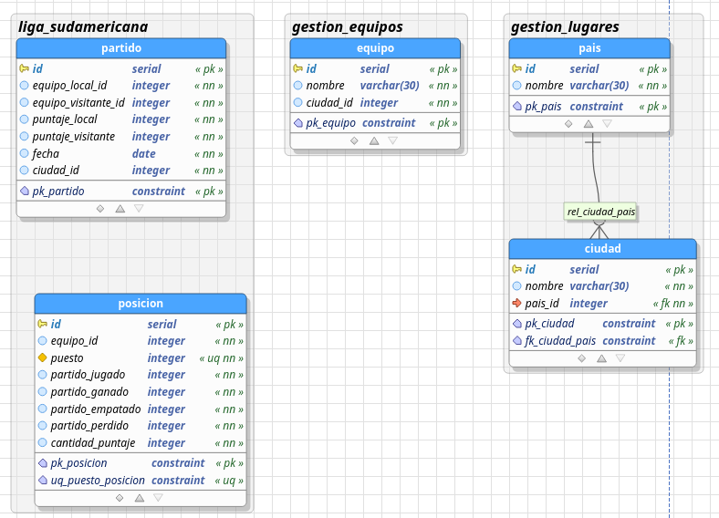

# Liga sudamericana MID

API MID del proyecto para prueba de gestion de liga sudamericana de la oficina asesora de sistemas

- este proyecto hace parte del MID de la siguiente arquitectura de aplicaciones:


- implementa el API de middleware encargado de acceder a las APIs crud para generar las operaciones de logica de negocio y dar servicos por medio de endpoints al cliente


- Para desplegar el API es necesario:
- tener la base de datos creada
- Tener instalado GO y beego


- tener las APIS CRUD [lugares](https://github.com/CarlosGutierrezArdila/gestion_lugares_crud) [equipos](https://github.com/CarlosGutierrezArdila/gestion_equipos_crud) y [liga](https://github.com/CarlosGutierrezArdila/liga_sudamericana_crud) de los servicios corriendo

- luego se ejecuta el comando: 

```
 bee run 
```

- para generar documentacion con swagger

```
 bee run -downdoc=true -gendoc=true 
```

- [Licencia](LICENSE)
